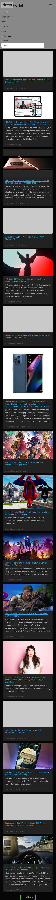

# news-portal
A website made with react that fetches news data from an API and display news headlines and weather forecast.

## Preview

_**Desktop**

_**Mobile**

## APIs Consumed

* [NewsAPI](https://newsapi.org) For fetching news data
* [ip.nf](https://ip.nf/me.json) For getting visitor`s location

## React Components

* [React-Bootstrap](https://react-bootstrap.netlify.app) For styled components
* [React Weather Component](https://github.com/farahat80/react-open-weather)
* [React Placeholder](http://buildo.github.io/react-placeholder) For skeleton loading

## Others

* [React router](https://reactrouterdotcom.fly.dev) For routing
* [Bootstwatch](https://bootswatch.com/) Bootstrap theme

###Author

- Twitter - [@Ibrahim_Isa274](https://www.twitter.com/Ibrahim_Isa274)
